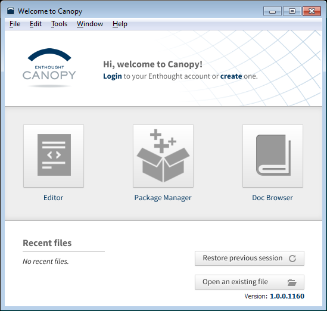
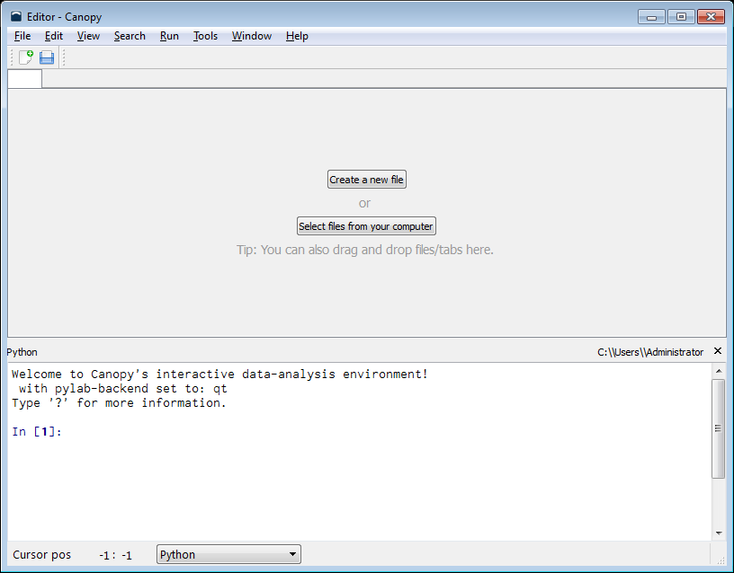
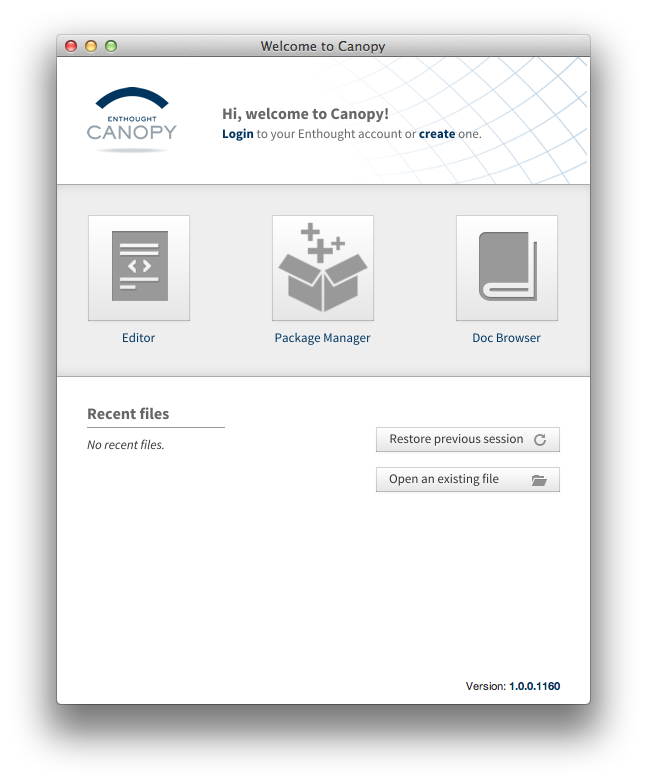
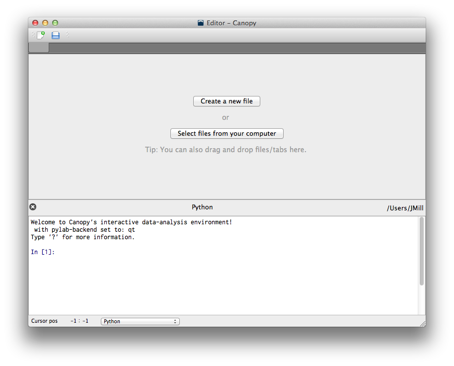



Show 00: Python Setup
*************************

Think about when you were learning to speak a foreign language. Before you could comfortably speak anything intelligible, you had to plow through vocabulary lists and grammar concepts.

While Python is a *programming language*, if you approach the language like any traditional language, you'll have the right mindset. The exercises we will be performing may seem, at first glance, to be elementary and boorish, but if this is your first time programming you will probably find the exercises to be somewhat challenging. (They'll probably still be a bit boorish! ha)

To program with Python (like most programming languages), you'll *write* to your computer and it will write back. This back-and-forth of writing is called **programming**, or just **coding**. It's how we talk with computers to make them do stuff, and for them to tell us neat stuff in return. From personal experience, when I first started learning to code, I struggled for a long time, in part because I got frustrated with how **explicit** you must be in your writing. [#]_ If you're used to writing fluffy poetry, writing code is the direct opposite. Yet, just as well-composed poetry can be beautiful, well-crafted code can be elegant. *Ah, sweet mystery of life, now that I have found you.*

Moving on...

Lets introduce you to Python. These are the steps to perform to get your computer set up. For today, we will use the Enthought Canopy package. [#]_ Follow these instructions as exactly as possible.

Windows
============================

1. Go to http://www.enthought.com/canopy-express/ with your browser and download Canopy Express.  If you are asked to create an account first, do so.
#. Go to your downloads folder and double-click the Canopy installer.
#. Follow the prompts (Click "Next" a bunch of times) to finish the installation.
#. Double-click the Enthought Canopy Express icon on your desktop.

Windows: What You Should See
---------------------------------------------

On my computer, one window appears. It is a welcome screen and shows this:

|Windowswelcome|

Click the *Editor* button.  The *Editor* window will appear:

|Wineditor|

Click *Create a new file*.

Mac OSX
============================ 

1. Go to http://www.enthought.com/canopy-express/ with your browser and download Canopy Express.  If you are asked to create an account first, do so.
#. Go to your downloads folder and double-click the Canopy installer.
#. Install Canopy by drag-and-dropping the Canopy icon into your Applications folder.
#. Go to your Applications folder and click the *Canopy* icon.

OSX: What You Should See
------------------------------------------
On my computer, one window appears.  It is a welcome screen and shows this:

|Macwelcome|

Click the *Editor* button.  The *Editor* window will appear:

|Maceditor|

Click *Create a new file*.

    

Linux
============================
There are many flavors of Linux with a multitude of installation options. If you're using Linux you are probably comfortable with how to install packages. The general approach is to:

1. Go to http://www.enthought.com/canopy-express/ with your browser and download Canopy Express.  If you are asked to create an account first, do so.
#. Go to your downloads folder and double-click the Canopy installer.
#. Follow the prompts (Click "Next" a bunch of times) to finish the installation.
#. In your Applications folder, click Enthought Canopy Express.

.. [#] That's a double entendre!
.. [#] While OSX comes with Python already, it doesn't have some extra stuff like graph-making abilities, so we are going to use the Enthought Python distribution to get up and running more easily.

