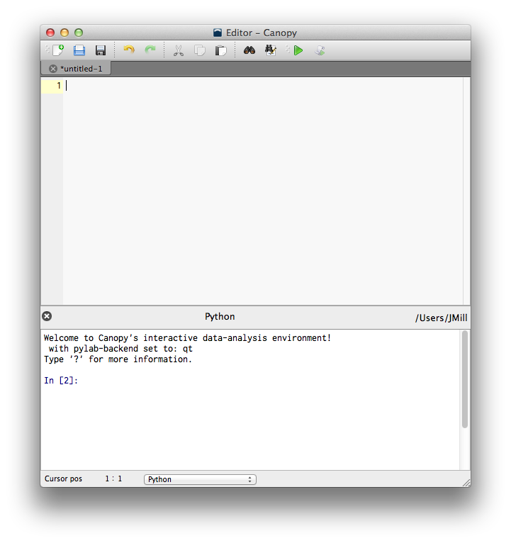
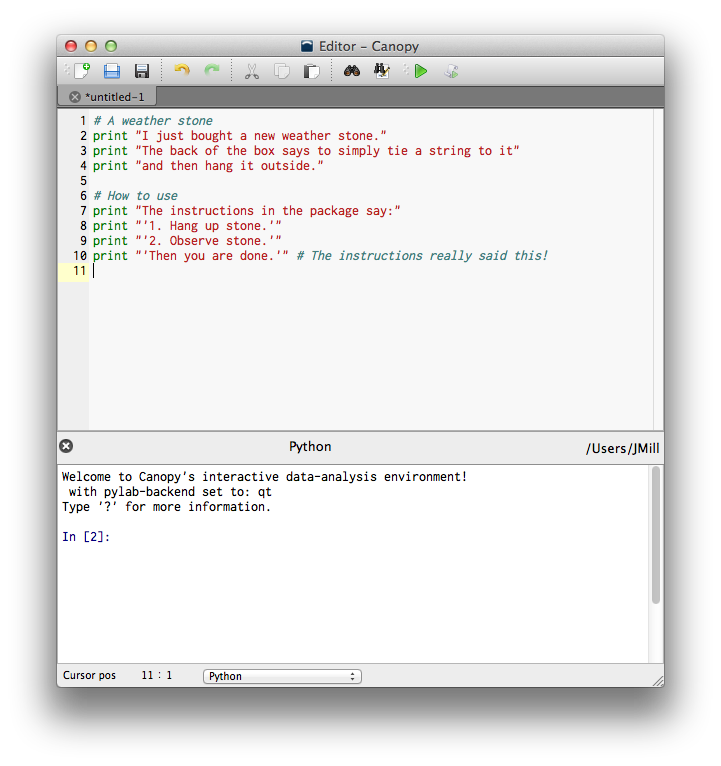
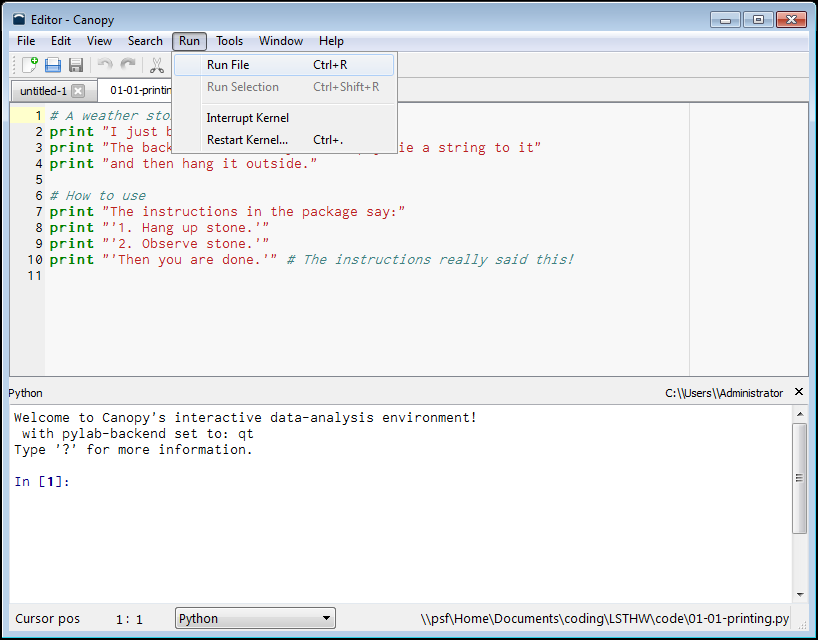
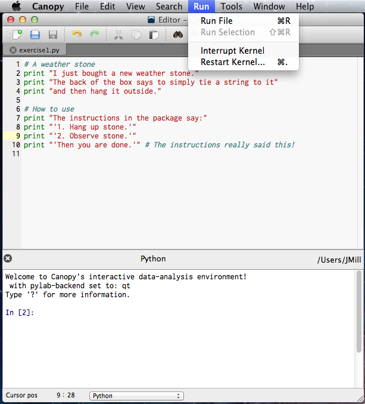
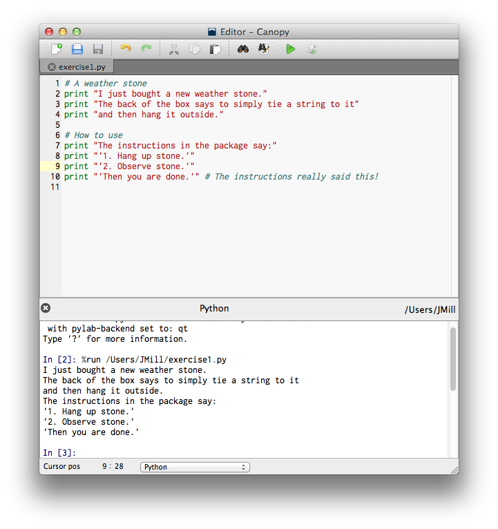



Show 01: Your first program
************************************

In the Editor, create a new file if you didn't already done so in the previous exercise.  You will see a blank editor area and a blank *Python* area. 

|macemptyeditor|

You will type stuff into the top section and, later, that stuff will cause other things to be displayed in the bottom section.

When I write 'type the code', or 'create a new file', this is the window to which I'm referring, specifically the top section.

Write the following code in the editor. Do not copy and paste. **Type each and every character exactly as typed below.**  

|printinginput|

Then save what you wrote by clicking File | Save As... 

Name this file *exercise1.py*.  While it doesn't matter where you save the file, I put mine in a new folder called "Python Workshop". You can, too.

Then click Run | Run Module. On Windows this looks like:

|Windowsrunmoduleprinting|

On Mac, the Run | Run Module menu looks like this:

|Macrunmoduleprinting|

What you should see
==================================
Upon clicking "Run Module", Python will respond with the following if you typed it correctly. (Look at the bottom section, below where it says *Python*.)

|printingoutput|

If you didn't get the same thing I did, then carefully go through the code line-by-line. One incorrect symbol can cause things to run improperly, if at all.

.. NOTE::
    Notice that single (') or double (") quotes can be used. You just have to be consistent within each line of code. When in doubt, use double quotes.
