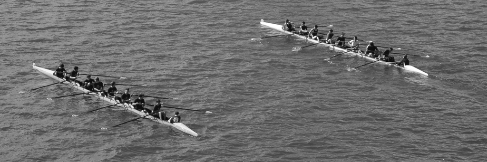



Show 05: Rowing
*******************************************

A data table associated with `The Boat Race <http://en.wikipedia.org/wiki/The_Boat_Race>`_ is below. It contains the weight in pounds of each team member who participated in The Boat Race, an annual competition between rivals Cambridge University and Oxford University. This data happens to be from the 1992 race.

=================  ============  ==============
Weight (pounds)     School          Position
=================  ============  ==============
188.5               Cambridge       Rower
183                 Cambridge       Rower
194.5               Cambridge       Rower
185                 Cambridge       Rower
214                 Cambridge       Rower
203.5               Cambridge       Rower
186                 Cambridge       Rower
178.5               Cambridge       Rower
109                 Cambridge       Coxswain
186                 Oxford          Rower
184.5               Oxford          Rower
204                 Oxford          Rower
184.5               Oxford          Rower
195.5               Oxford          Rower
202.5               Oxford          Rower
174                 Oxford          Rower
183                 Oxford          Rower
109.5               Oxford          Coxswain
=================  ============  ==============

As you were researching rowing, you may have noticed the odd needle-like shape of the racing boats.  The data above is for a pair of nine-person boats. (Notice that there are 9 people listed under the Cambridge team, and 9 listed under the Oxford team.)

Below is a photo I took of two nine-person boats for your reference.

|rowingeight|

To get acclimated with this dataset, start by calculating the mean weight of the Cambridge team.  Try this now with just a pencil and paper. [#]_

Your result should be about 182.44 pounds.

Remember the complex-looking Approach #3 from the Hobbit exercise? It utilized some handy Python tools, including lists, functions, and variables. I am going to use that code as a reference to create something similar for the Cambridge rowing data.  Then we'll compare the code output to the answer you calculated by hand.

Calculating the Cambridge mean
================================

Type this code and save it as mean-cambridge.py.

{{ ork.code('code/05-01-mean-cambridge.py|pyg') }}

The Cambridge mean is...
==========================
After clicking Run, you should get this::

    {{ d['code/05-01-mean-cambridge.py|py']|indent(4) }}

Stepping through the code
=============================

**Line 1:**

::
    
    cambridgeWeights = [188.5, 183, 194.5, 185, 214, 203.5, 186, 178.5, 109]

*Lists* of data are denoted with a pair of brackets, ``[`` and ``]``. Each individual data point is separated by a comma, ``,``.  Reading right-to-left, the nine Cambridge teammates' waits are enclosed in a list and then assigned to a new variable called ``cambridgeWeights``.  By assigning the list to a variables, you only have to type the data in once. Anytime you want Python to refer to the data, you just mention ``cambridgeWeights``.  This saves a lot of typing and makes it easier to read your code. 

**Line 2:**

::

    sumWeights = sum( cambridgeWeights )

Python has a built-in **function** called ``sums()``, which works with lists. By writing ``sum(aList)`` and putting in the name of a specific list, Python will read through the list and add up all the numbers. So you don't have to keep typing ``sum(cambridgeWeights)`` every time you need to find the sum of the team, we put the result of ``sum(cambridgeWeights)`` into a new variable called ``sumWeights``.  Thus, ``sumWeights`` has the value 1642.0. Try adding up by hand all the Cambridge weights to confirm that you get the same result.

**Line 3:**

::

    teamSize = len( cambridgeWeights )

Like ``sum()``, there is also a built-in function that determines the *length* of a list (i.e. how many pieces of data are in the list).  The function is ``len()``.  How many individual weights did you add to the list in Line 1?  Nine.  Thus, the variable ``teamSize`` has a value equal to ``len(cambridgeWeights)``, which is "9".

**Line 4:**

::

    mean = sumWeights / teamSize

Using the variables we created earlier, ``sumWeights`` and ``teamSize``, divide the former by the latter (i.e. 1642.0 divided by 9) and put the result a variable called ``mean``.

**Line 5:**
::
    
    print mean, "pounds"

Display the contents of the ``mean`` variable and append the string "pounds" to the end of the line.

Study Drill
=============

- Using the above code as a reference, create a new script called mean-oxford.py that calculates the average weight of the Oxford crew.  Your result should be about 180.4 pounds.
- Search online for "python sum". How can it be used? Try some sample code.
- Search online for "python len". How does it work with lists?

.. [#] Recall that the equation for mean is :math:`\frac{\text{sum of values}}{\text{number of values summed}}`