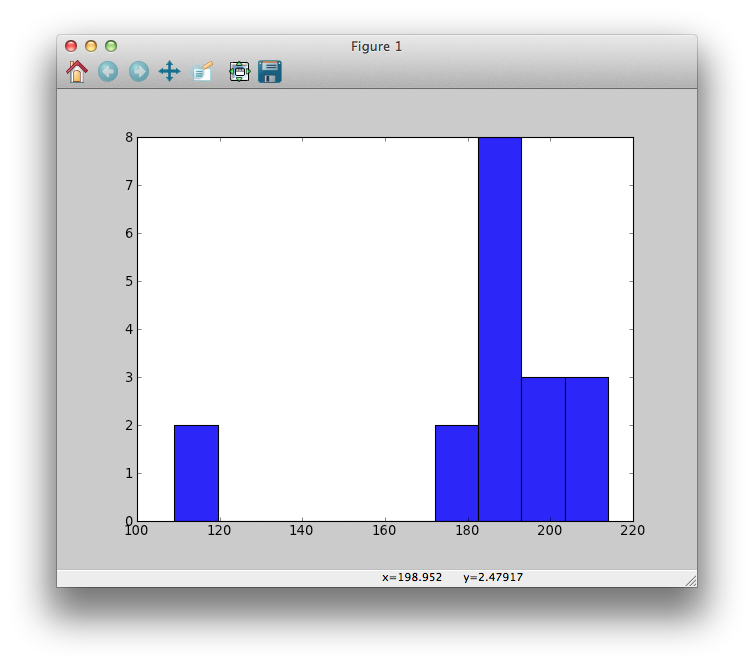



Show 07: Yet More Rowing
*******************************

Staring at many rows data and lines of code can make your eyes gloss over. That's why statisticians and their ilk invented charts. More importantly, charts can make it really easy to spot trends hidden in tables of numbers and text.  

Type this
===========

Type the following code and save it as rowingweights.py.

{{ ork.code('code/07-01-rowweights.py|pyg') }}

What you should see
=========================

When you run this code, a chart should appear on your screen.

|rowingweightshist|

Wow, you made a picture! It might not be the prettiest, but it's a start.

This type of picture is called a *histogram*.  However, it's missing some important things, like a meaningful title and labels. Revise the code to look like this:

{{ ork.code('code/07-02-rowweights-labels.py|pyg') }} 

Then run the script.

Ah, that's better
======================

|rowingweightshistv2|

The x-axis (the horizontal axis) shows the weight, in pounds, of all the rowing members who competed. The y-axis (the vertical axis) measures *how many* team members have similar weights.  For example, the histogram shows that there are two team members who have a weight between approximately 100-120 pounds.

Stepping through the revised code
=====================================

**Line 1:**

:: 

    import pylab

This tells Python to add a toolbox called *pylab*.  You are not expected to have any prior experience with pylab or to know that it even existed before this exercise. Just know that pylab is a set of tools, and with pylab's help you can make slick graphs. [#]_

**Lines 4-5:**

::

    cambridgeWeights = [188.5, 183, 194.5, 185, 214, 203.5, 186, 178.5, 109]
    oxfordWeights = [186, 184.5, 204, 184.5, 195.5, 202.5, 174, 183, 109.5]

Create two variables, ``cambridgeWeights`` and ``oxfordWeights``, and assign to them lists of rower's weights.

**Line 8:**

::
    
    totalWeights = cambridgeWeights + oxfordWeights

Combine the two lists into one big list, ``totalWeights``.  ``totalWeights`` contains all eighteen weights:

::

    >>> totalWeights
    [188.5, 183, 194.5, 185, 214, 203.5, 186, 178.5, 109, 186, 184.5, 204, 184.5, 195.5, 202.5, 174, 183, 109.5]

**Line 11:**

::

    pylab.hist(totalWeights)

This is your first exposure to Python's dot notation.  Reading right-to-left (remember that advice from a while ago?), this line puts the ``totalWeights`` variable into the ``hist()`` function, which is located inside ``pylab``.  ``hist()`` is short for *histogram*, which is the type of chart you plotted in this exercise.  There are many other types of charts and we'll explore them later.

**Lines 12-14:**

::
    
    pylab.title("The Boat Race crew histogram")
    pylab.xlabel("Weight in pounds") 
    pylab.ylabel("Number of members") 

These three lines are technically optional, as you saw when you generated your first graph, above. However, you should include them so it is clear to you what you're plotting.  From experience, if I don't label something I'm likely to forget what type of data is displayed in the chart.

**Line 15:**

::
    
    pylab.show()

``pylab.show()`` is used to show the graph on the screen. This line is always placed after constructing the graph, ``pylab.hist(someData)``, and after adding a title and axis labels.

In the next exercise you will see how the histogram helps show a trend in the rowing data.

.. [#] I called pylab a toolbox but programmers call it a *module*. Modules are just collections of code that people have written and made available for us to use. These people are very generous because they don't charge us for their hard work. Keep this in mind so that some day in the future you can 'pass it on' and spread the good vibes.

Study Drills
==============

Search online for "pylab gallery".  Look through the gallery. (You'll see mention of "matplotlib", which is sort of like a big crate that contains the pylab toolbox, along with other toolboxes.) There are many samples of the neat pictures you can make with pylab/matplotlib. We'll learn how to make some of these types of images. If something catches your eye:
    
- Read more about it. 
- Try running any sample code if it is provided.  
- Try guessing what each line of code performs.  
- If there's something you don't understand, jot it in your notes so you can come back to it later when you have more knowledge.

